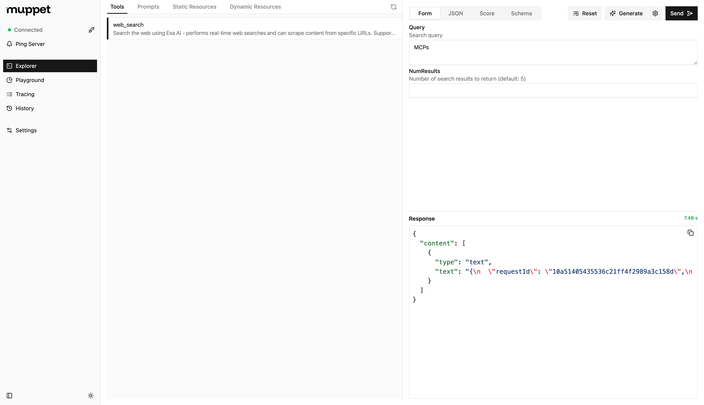

# Muppet Kit

It is a collection of tools for testing and debugging MCPs.

## Inspector

It is a devtool for testing and debugging MCPs servers.



### Usage

```bash
npx muppet-kit inspector
```

### Features

- Explorer - Explore the MCP server's capabilities, while leveraging AI to assist you.
- Playground - Test the MCP server with different LLMs and configurations. (Coming soon)
- Tracing - Trace the requests and responses between the client and server. Tunneling is also supported for connecting to remote clients.
- History - View the history of requests and responses between the client and server for the current session.

### Configuration

You can configure the inspector by creating a `muppet.config.js`/`muppet.config.ts` file in the root of your project. The configuration file should export an object with the following properties:

```ts
import { defineInspectorConfig } from "muppet-kit";

export default defineInspectorConfig({
  // ... inspector config
  // The inspector will automatically load the config from the file
});
```

## Credits

- The idea for this project was inspired by the official [MCP Inspector](https://github.com/modelcontextprotocol/inspector) and their amazing work.
